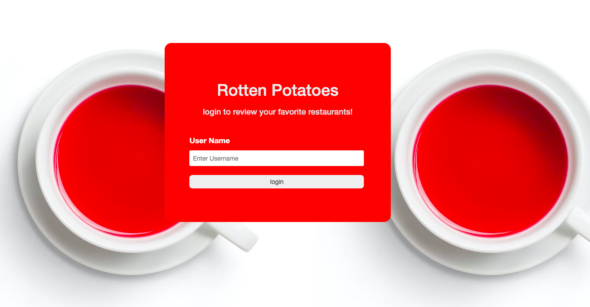
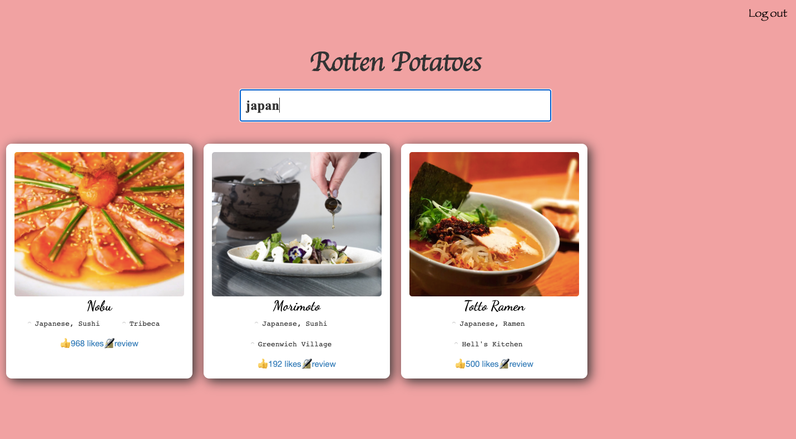

<h1>Rotten Potato</h1>

## Table of Content
<ul>
  <li><a href="#About">About</a></li>
  <li><a href="#Features">Features</a></li>
  <li><a href="https://jsapp-rotten-potatoes.herokuapp.com/">Live Site</a></li>
  <li><a href="#Stacks">Stacks</a></li>
</ul>

## About

 Rotten Potatoes is New Yokers' local guide to discover the best restaurants around you. Rotten Potatoes is implemented with zomato API, users can search the restaurants with location or name with ease. Users can also check out the restaurants reviews from other users. Leave reviews to the restaurants they've been to.

     
     

## Features
  <ul>
      <li>Utilized JSON Web Tokens and Zomato Api to allow users to review restaurants.</li>
      <li>Developed a Rails back-end in order to store user accounts, comments, and associations.</li>
      <li>Applied custom CSS, including grid layout, modals, and CSS 2D animations.</li>
  </ul>
  

## Stacks
  <ul>
    <li>Ruby</li>
    <li>Ruby on Rails</li>
    <li>CSS 2D animation and Bootstrap</li>
  </ul>
